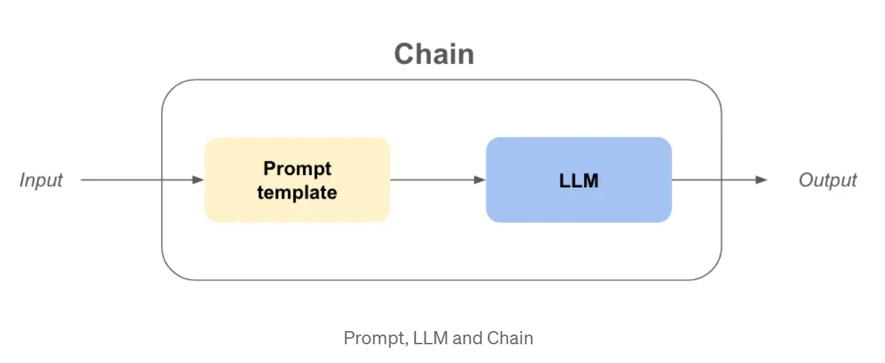

# Langchain 

First of al, on the [app.py](app.py), The chains are used by using basic prompt template and the huggingface distilgpt2 and API , which is on the .env,  to understane how to use the **langchain** basicly.

Then, The Gemini-2.5-Flash was used by using kwarg after the GOOGLE_API_KEY was generated and declared as environment variables on .env.

## [Prompt Templates](langchain_prompt_template)

Prompt templates help to translate user input and parameters into instructions for a language model. This can be used to guide a model's response, helping it understand the context and generate relevant and coherent language-based output -- <cite>Langchain [1]</cite>.

[1] https://python.langchain.com/docs/concepts/prompt_templates/

