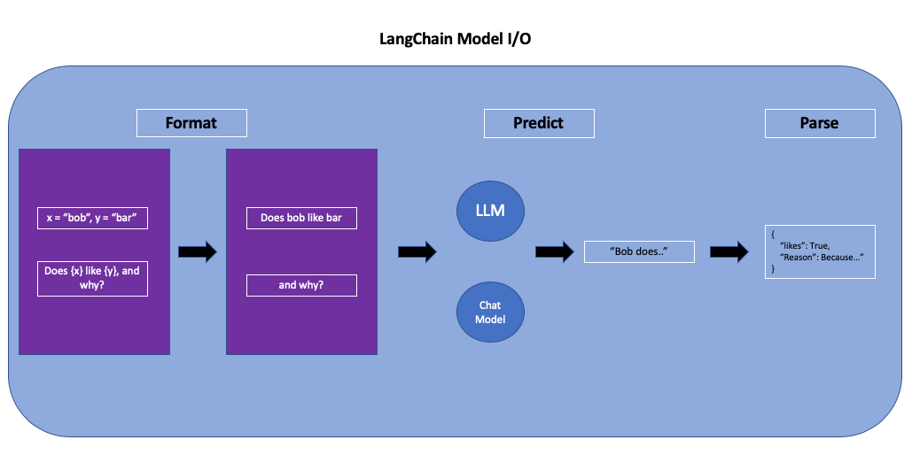

# Langchain 

First of al, on the [app.py](app.py), The chains are used by using basic prompt template and the huggingface distilgpt2 and API , which is on the .env,  to understane how to use the **langchain** basicly.

Then, The Gemini-2.5-Flash was used by using kwarg after the GOOGLE_API_KEY was generated and declared as environment variables on .env.

## [Prompt Templates](langchain_prompt_template)

> Prompt templates help to translate user input and parameters into instructions for a language model. This can be used to guide a model's response, helping it understand the context and generate relevant and coherent language-based output [1]. 

By using claude-opus-4 and Gemini-2.5-Flash (both google api and langchain_google_genai), converted the customer reviews into tones and languages which was given as input. 

## [Structured Output Parsers](langchain_output_parser)
### [Dictionary Parser](langchain_output_parser/app_langchain_google_api_langchain_parser.py)
Firstly, on **Dictionary parser**, A list which includes the keys of information, we want to extract from messages and declared by using [ResponseSchema](https://python.langchain.com/api_reference/langchain/output_parsers/langchain.output_parsers.structured.ResponseSchema.html) with their descriptions and names, is created. After that, An output parser which gives us JSON was declared by giving the list of response shemas as input. Then, the output parser was given in the prompt template during formating messages. Finally, the content of the output of the chat model was parsing by using output parser which we declared.  

### [Pydantic Parser](langchain_output_parser/app_langchain_google_pydantic_parser.py)

Instead of using ResponseShema, Pydantic [Base model class](https://docs.pydantic.dev/latest/api/base_model/) was used to extract information. This provides us validation of fields which are declared in the class. 

## Memory & Chains
### [Memory](langchain_memory)

[1] https://python.langchain.com/docs/concepts/prompt_templates/